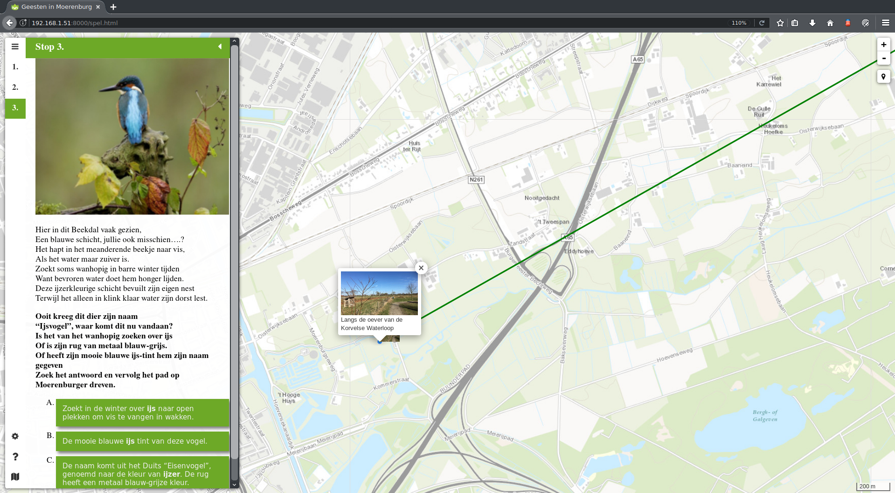
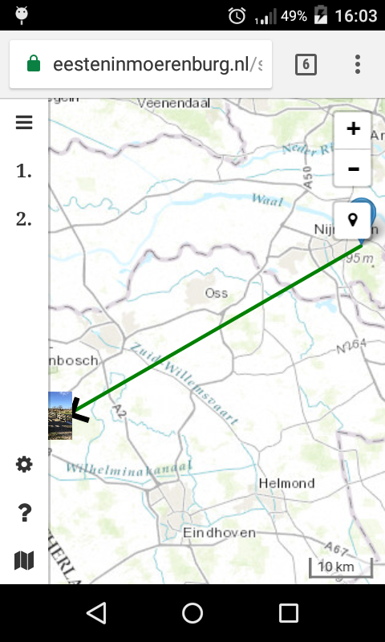

# Geesten in Moerenburg

[GeesteninMoerenburg.nl](GeesteninMoerenburg.nl) is a GPS-based scavenger hunt, that you can walk with you smart phone or tablet.
Your are guided by a map to walk to a location.
Here you get quiz related to the location, when you complet that your are guided to the next location.

| | |
|:---:|:---:|
|Firefox Screenshot |Android Screenshot |

# Technical details

Its a simple static one page site, that uses new HTML5 features like GPS and local storages.
* Once the pages is fully loaded it can be accessed offline.

# Acknowledgments

commission by "working group Moerenburg from [nature guide course IVN](https://www.ivn.nl/cursussen)"
